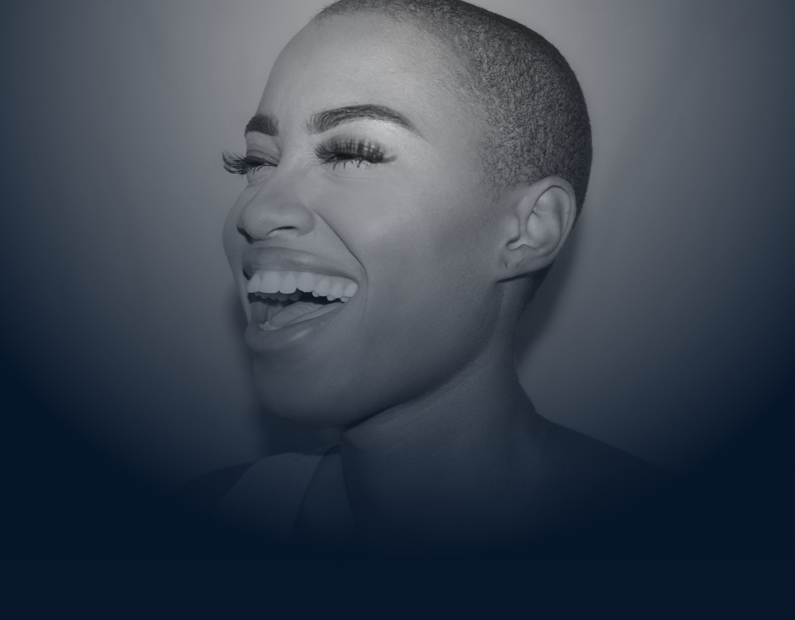

# CSS advanced - SmileSchool

## Description
This project follows **HTML advanced**. The HTML structure of the SmileSchool landing page
was already built; here I add all the **style** with CSS to match the Figma design file.

## Live page
https://hodali-1.github.io/alu-web-development/css_advanced/

## What is styled
| Section | Style |
|---------|-------|
| Header | Centered container, logo on the left, 3 white links on the right |
| Banner | Background image, big "Get schooled" title, purple button, 4 rounded profiles |
| Quote | Purple background, rounded picture on the left, quote on the right |
| Videos | 4 cards with rounded corners, play icon, author and 5-star rating |
| Membership | Dark background, 4 purple icons, register button |
| FAQ | 2 x 2 grid of questions |
| Footer | Logo, social media icons and copyright |

## Techniques used
- CSS Flexbox for all the layouts
- Simple class selectors
- `border-radius` for rounded images, cards and buttons
- `::before` pseudo-element for the play icon on the videos

## Author
Hodali - [GitHub](https://github.com/Hodali-1)
